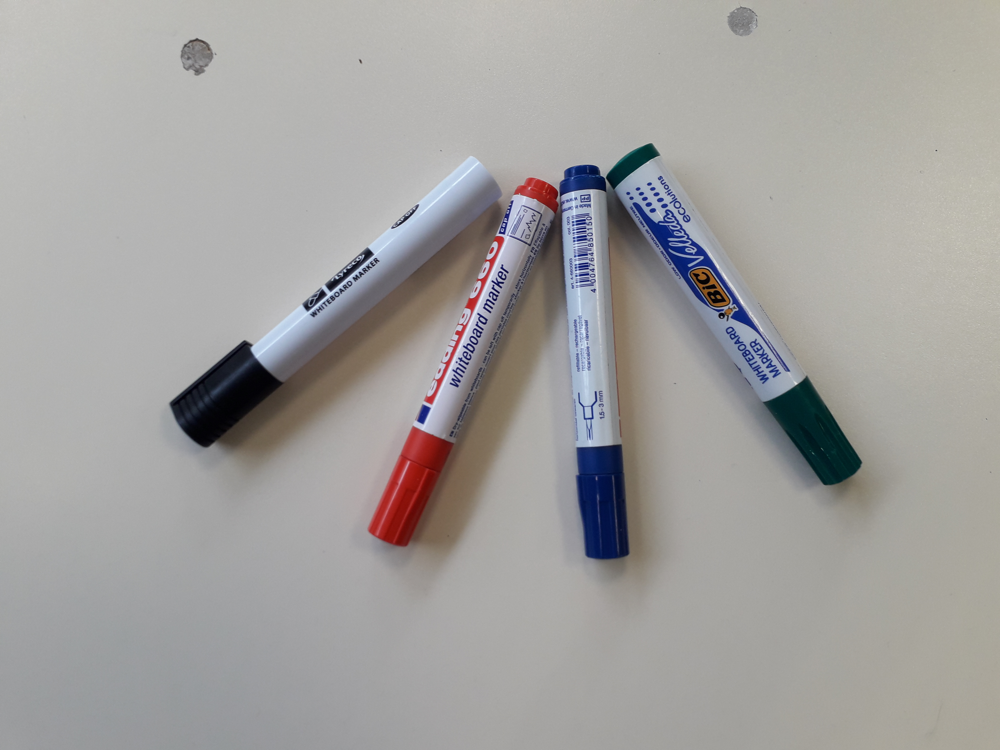
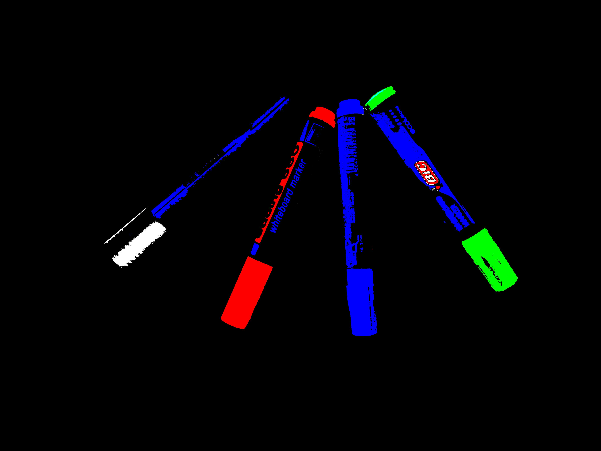
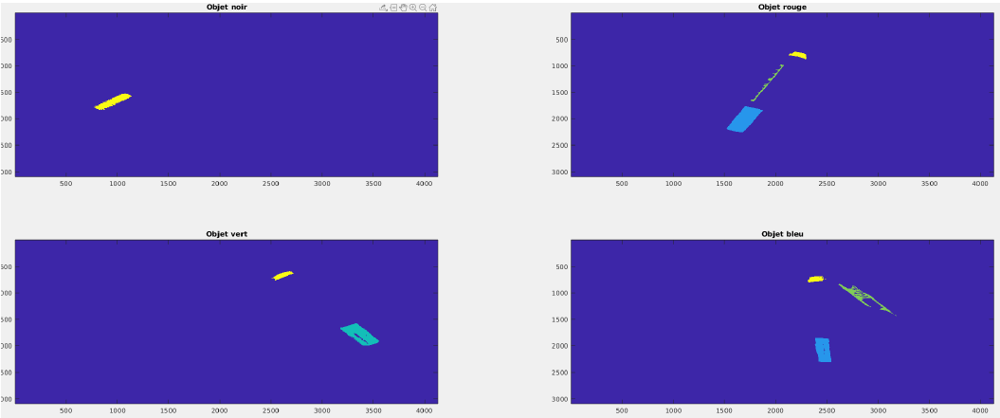
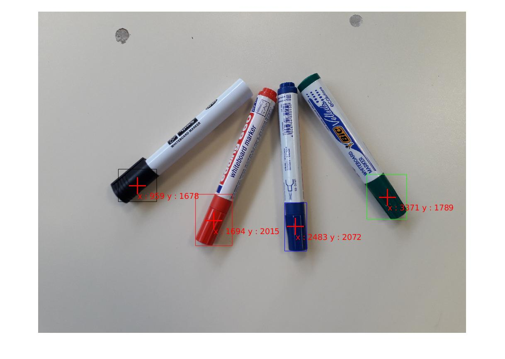

# Simple_Segmentation_Image
Segmentation et calcul de barycentres d'objets présents sur une image.
### Exemple d'application : Trouver les barycentres des bouchons avec leurs couleurs. 

### Image après seuillage

### Les objets connexes de surface suffisante sont indexés et séparés.

### Sélection de l'objet, calcul du barycentre et présentation des résultats.

Plus de détails dans le répertoire __Docs/__
